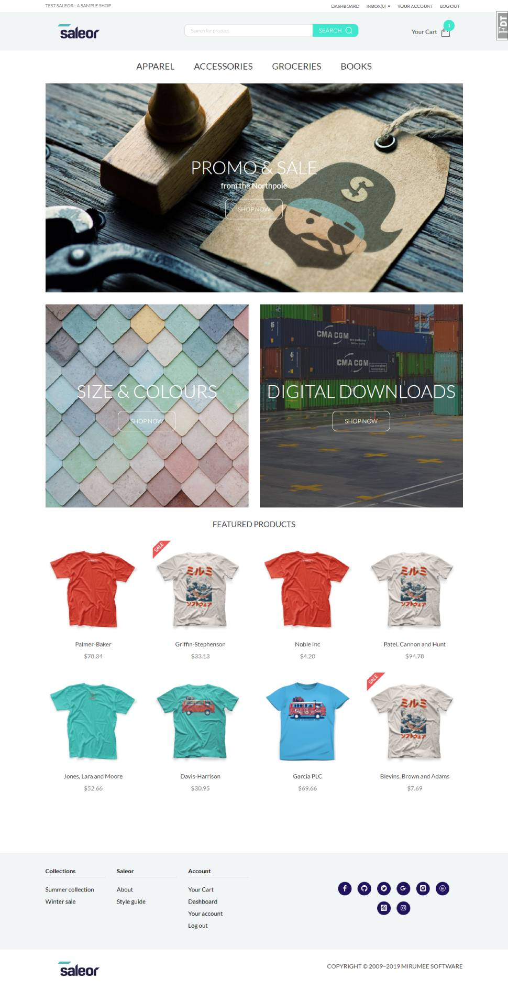
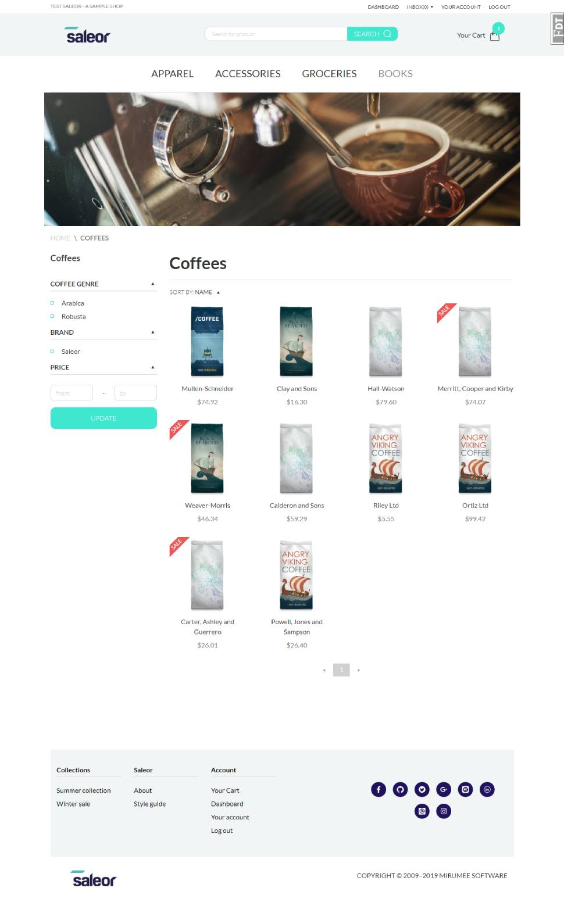

# flask shop


## Introduction
This project is a front page copy of [saleor](https://github.com/mirumee/saleor) old version, but write with flask. 
It havn`t complete yet.

## ScreenShot




## Quickstart

### Use python virtual environment
**First, Clone and Install dependence**
```
git clone https://github.com/hjlarry/flask-shop.git
cd flask-shop
python3 -m venv .venv
# on windows, you should run .venv\Scripts\activate.bat 
source .venv/bin/activate
pip3 install -r requirements.txt
```

**Second, Init db and run**
```
# modify .flaskenv and flaskshop/setting.py
flask createdb
flask seed
flask run
```

### Use Docker 
**First, Build image and run in background**
```
docker-compose up -d
```
**Second, enter container and add fake data**
```
docker-compose exec web sh
flask createdb
flask seed
```
### About Config
The default admin account is:

username|password|role
---|---|---
admin|admin|super administrator
editor|editor|editor
op|op|operator

If the js files has been modified, you need to:
```
npm install
npm run build
```

Redis and Elasticsearch is unabled by default, You can enable them for good performence and search ablitity.