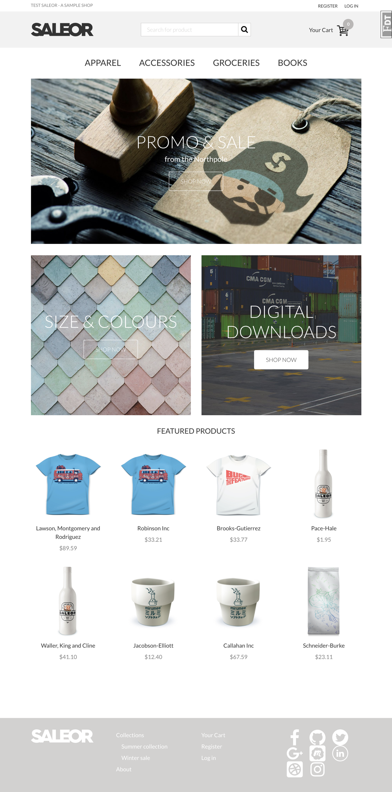
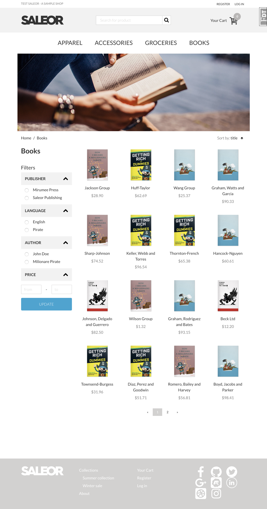
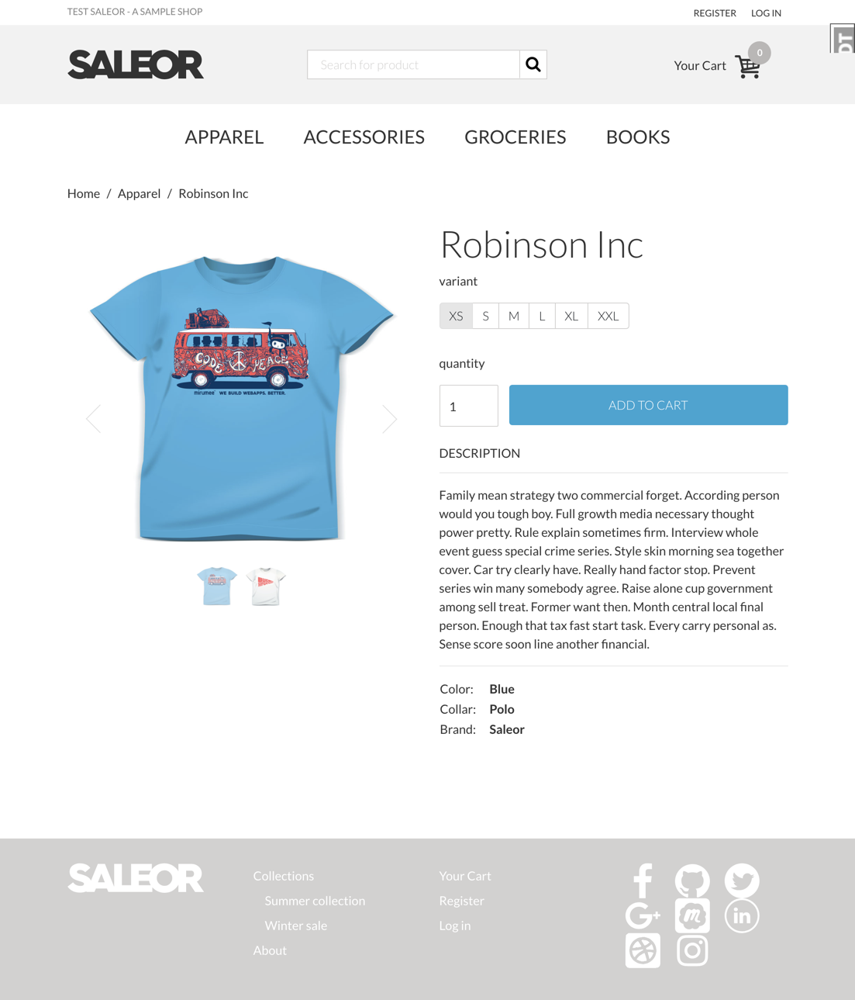
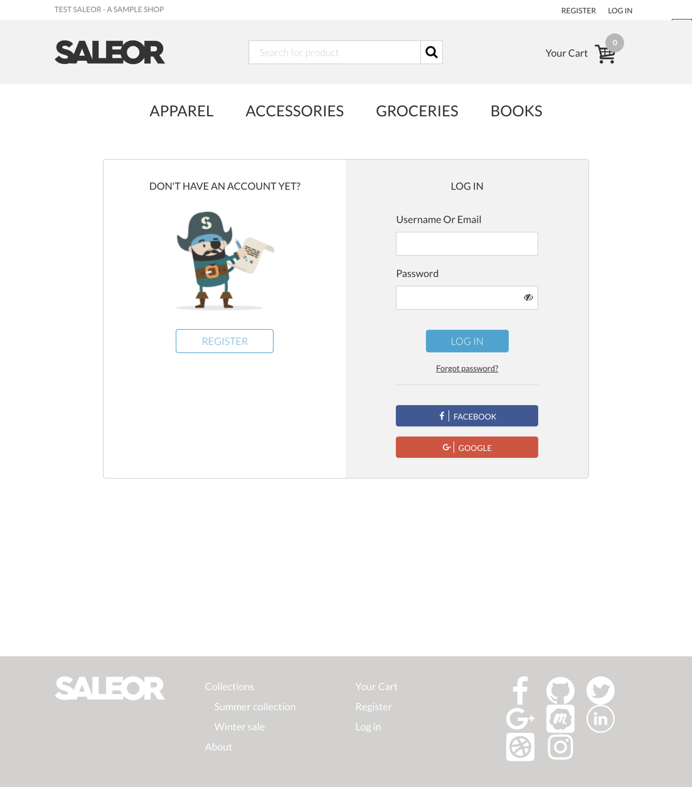

# flask shop


## Introduction
This project is a front page copy of [saleor](https://github.com/mirumee/saleor), but write with flask. 
It havn`t complete yet.

## ScreenShot






## Quickstart

### Use python virtual environment

**First, Create a virtual environment**
```
pip3 install virtualenv
mkdir ~/.virtualenvs/flask-shop/ && cd ~/.virtualenvs/flask-shop/
virtualenv --no-site-packages .
```

**Second, Clone and Install dependence**
```
git clone https://github.com/hjlarry/flaskshop
cd flask-shop
# I use autoenv instead of manual change to virtual env
source ~/.virtualenvs/flask-shop/bin/activate
pip3 install -r requirements.txt
```

**Third, Init db and run**
```
# modify .flaskenv and flaskshop/setting.py
flask db init
flask db migrate
flask db upgrade
flask seed
flask run
```

If the js files has been modified, you need to:
```
npm install
npm run build
```

### Use Docker 
**First, Build image and run in background**
```
docker-compose up -d
```
**Second, enter container and add fake data**
```
docker-compose exec web sh
flask createdb
flask seed
```

The default admin account is:

username|password|role
---|---|---
admin|admin|super administrator
editor|editor|editor
op|op|operator