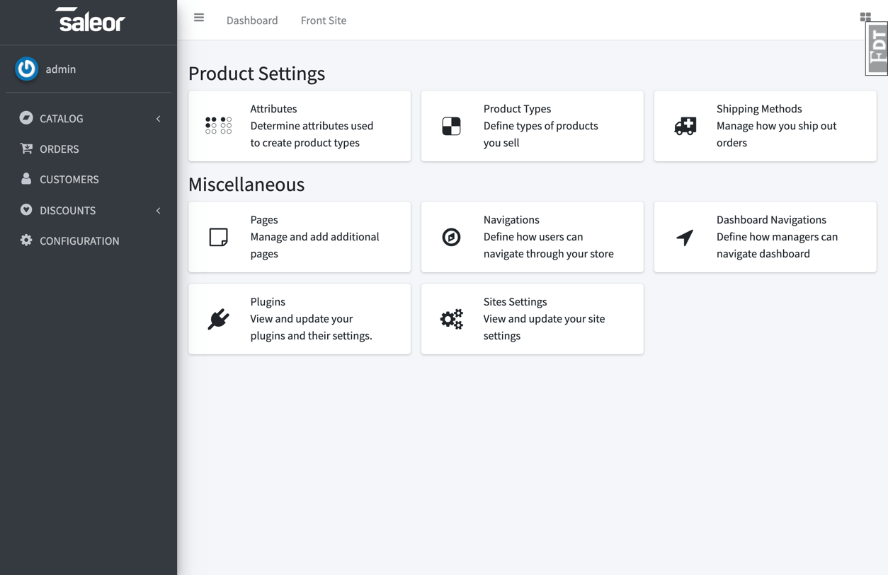
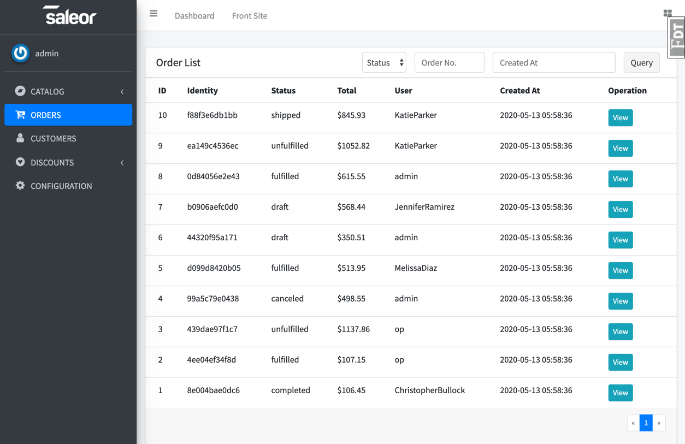

# Flask Shop - An Amazing Project


## Introduction
This project is a front page copy of [saleor](https://github.com/mirumee/saleor) old version, but written with flask. 
It hasn't completed yet.

## ScreenShot

<table align="center">
    <tr>
        <td align="center">
            <a href="https://raw.githubusercontent.com/hjlarry/flask-shop/master/ScreenShot/1.png">
                
            </a>
        </td>
        <td align="center">
            <a href="https://raw.githubusercontent.com/hjlarry/flask-shop/master/ScreenShot/2.png">
                
            </a>
        </td>
        <td align="center">
            <a href="https://raw.githubusercontent.com/hjlarry/flask-shop/master/ScreenShot/3.png">
                
            </a>
        </td>
    </tr>
    <tr>
        <td align="center">
            <a href="https://raw.githubusercontent.com/hjlarry/flask-shop/master/ScreenShot/4.png">
                
            </a>
        </td>
        <td align="center">
            <a href="https://raw.githubusercontent.com/hjlarry/flask-shop/master/ScreenShot/5.png">
                
            </a>
        </td>
        <td align="center">
            <a href="https://raw.githubusercontent.com/hjlarry/flask-shop/master/ScreenShot/6.png">
                
            </a>
        </td>
    </tr>
</table>


## Quickstart

### Use python virtual environment
**First, Clone and Install dependence**
```
git clone https://github.com/hjlarry/flask-shop.git
cd flask-shop
python3 -m venv .venv
# on windows, you should run .venv\Scripts\activate.bat 
source .venv/bin/activate
pip3 install -r requirements.txt
```

**Second, Init db and run**
```
# modify .flaskenv and flaskshop/setting.py
flask createdb
flask seed
flask run
```

### Use Docker 
**First, Build image and run in background**
```
docker-compose up -d
```
**Second, enter container and add fake data**
```
docker-compose exec web sh
flask createdb
flask seed
```

### Translation localization 
**Create .pot**
```
pybabel extract -F babel.cfg -k lazy_gettext -o messages.pot .
```

**Create new language file**

```
# Take a look babel.cfg
pybabel init -i messages.pot -d translations -l en_US
```

**Compile translations and select language**
```
# Select you language from .flaskenv
pybabel compile -d translations
```

**Update translations .pot**

```
pybabel extract -F babel.cfg -k lazy_gettext -o messages.pot .
pybabel update -i messages.pot -d translations -l en_US
```

## Settings
If you want change default settings create file .flaskenv with content:
```
FLASK_APP=autoapp.py
FLASK_ENV=develop
FLASK_DEBUG=1
FLASK_RUN_HOST=0.0.0.0
FLASK_RUN_PORT=5000
SECRET_KEY=abcdefgh
DB_TYPE = postgresql # mysql
DB_USER = root
DB_PASSWD = my_passwd
DB_HOST = 127.0.0.1
DB_PORT = 5432
BABEL_DEFAULT_LOCALE = en_US
BABEL_DEFAULT_TIMEZONE = UTC
BABEL_TRANSLATION_DIRECTORIES = ../translations
BABEL_CURRENCY = USD
GA_MEASUREMENT_ID = G-QCX3G9KSPC
``` 

### About Config
The default admin account is:

username|password|role
---|---|---
admin|admin|super administrator
editor|editor|editor
op|op|operator

If the js files has been modified, you need to:
```
npm install
npm run build
```

Redis and Elasticsearch is unabled by default, You can enable them for good performence and search ablitity.
